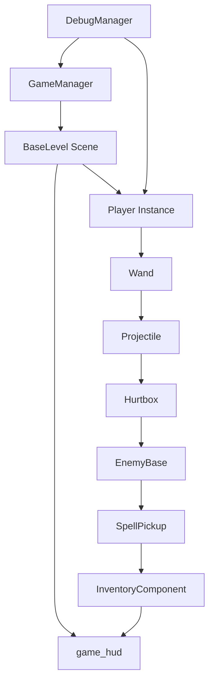
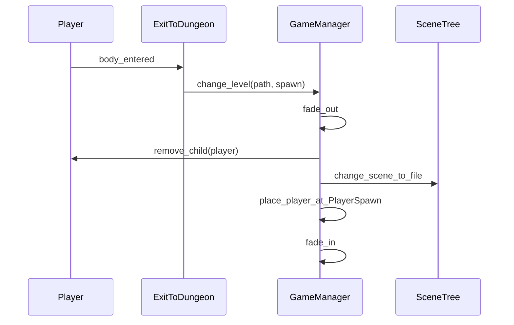
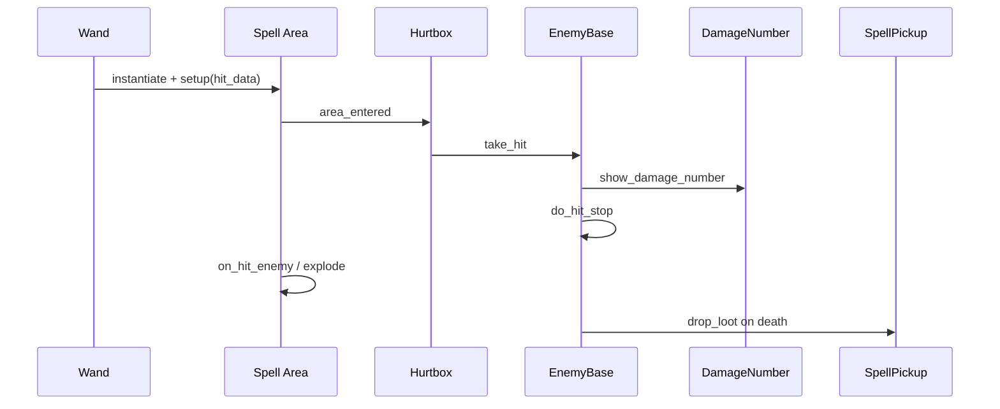
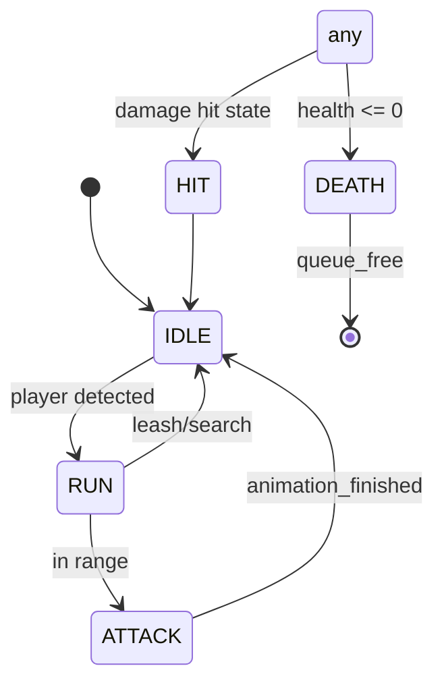
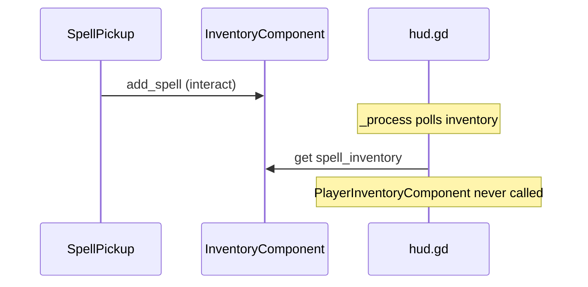

# Technische Projektanalyse — NoitaClone (Godot 4.6.1)

| | |
|---|---|
| **Datum** | 30. Mai 2026 |
| **Engine** | Godot 4.6.1 |
| **Plugin** | BetterTerrain |
| **Genre** | 2D Action-Platformer / Combat-Roguelite (Noita-inspiriert) |
| **Scope** | Read-only-Analyse, keine Codeänderungen |

> **Legende:** Funde sind als **sicher**, **wahrscheinlich** oder **Vermutung** markiert, sofern nicht anders angegeben.

---

## Inhaltsverzeichnis

1. [Executive Summary](#1-executive-summary)
2. [Projektstruktur-Analyse](#2-projektstruktur-analyse)
3. [Dateistruktur und Referenzen](#3-dateistruktur-und-referenzen)
4. [Szenenstruktur-Analyse](#4-szenenstruktur-analyse)
5. [Codestruktur-Analyse](#5-codestruktur-analyse)
6. [Dead Code und Cleanup](#6-dead-code-und-cleanup)
7. [Bug-Suche und Risikoanalyse](#7-bug-suche-und-risikoanalyse)
8. [System-Zusammenhänge](#8-system-zusammenhänge)
9. [Gamefeel-Analyse](#9-gamefeel-analyse)
10. [Gameplay-Loop-Analyse](#10-gameplay-loop-analyse)
11. [Godot-4.6.1-Prüfung](#11-godot-461-prüfung)
12. [Testplan und Debug-Tools](#12-testplan-und-debug-tools)
13. [Priorisierte TODO-Liste](#13-priorisierte-todo-liste)
14. [Konkreter Cleanup-Plan](#14-konkreter-cleanup-plan)
15. [Abschluss](#15-abschluss)

---

## 1. EXECUTIVE SUMMARY

### 1.1 Gesamtbewertung

| Dimension | Score (1–10) | Kurzfassung |
|-----------|:------------:|-------------|
| Produktionsreife | **4** | Solider Prototyp, kein shippbarer Core Loop |
| Erweiterbarkeit | **6** | Player/Enemy/Wand-Basis gut, Run-Layer fehlt |
| Debugbarkeit | **8** | `DebugManager` + Overlay sehr stark |
| Lesbarkeit | **7** | Klare Ordner, teils Duck-Typing |
| Stabilität | **5** | Death, TimeScale, Fade-Risiken |
| Performance-Risiko | **5** | HUD-Poll, Contact-Push O(n), Generator schwer |
| Gamefeel-Potenzial | **7** | Movement/Dash/FX gut angelegt |
| Vertical-Slice-Risiko | **6** | Kampf da, Meta/Build-Loop nicht |

### 1.2 Technische Gesundheit

Das Projekt ist **technisch gesund für einen frühen Vertical-Slice-Prototypen**, aber **noch nicht produktionsreif**. Die Architektur zeigt bewusste Godot-4-Patterns:

- Component-basierter Player
- Resource-basierte Wand/Spell-Daten (`WandData`, `SpellData`)
- Autoloads für Session (`GameManager`, `DebugManager`) und Terrain (`BetterTerrain`)
- `TileMapLayer` + BetterTerrain für Höhlen
- Level-Standard mit `World/*`, `PlayerSpawn`, `FadeRect`, `BaseLevel`

Aktiver Cleanup (Git-Status): Archiv-Generatoren entfernt, `GameManager`/`DebugManager` als Autoloads, `main_tileset`, konsolidierte TileMap-Szene.

### 1.3 Architektur

**Sauber im Kern, inkonsistent am Rand.**

| Stärke | Schwäche |
|--------|----------|
| Player-Komponenten klar getrennt | Globale Kopplung `GameManager.player` |
| `EnemyBase` skaliert für Archetypen | `enemy_base.gd` sehr groß (~771 Z.) |
| Wand-Cast-Pipeline funktional | HUD pollt statt Signals |
| Level-Transitions mit Fade | HUD pro Level dupliziert |
| Debug-Infrastruktur | Inventar-Equip ohne UI |

### 1.4 Starke Systeme

1. **Player Movement** — Coyote Time, Jump Buffer, variable Accel/Friction, Fall-Multiplier
2. **Dash + Block-Dash** — Charges, anim-sync Duration, Frame-Guard-Windows
3. **EnemyBase** — Patrol, Chase, Separation, Step-Up, Hit-Stop, Loot, Damage Numbers
4. **Wand/Spell** — Mana, Recharge-Cycle, Multi-Projectile, Crit-Roll
5. **Level-Transitions** — `BaseLevel` + `GameManager.change_level`
6. **DebugManager** — God Mode, Spawns, Slow-Mo, Overlay, Restart Room

### 1.5 Fragile Systeme

1. **Player Death** — `queue_free()` vs. persistenter `GameManager.player`
2. **`Engine.time_scale`** — Enemy Hit-Stop kollidiert mit Debug Slow-Mo
3. **HUD** — `_refresh_all_ui()` jeden Frame
4. **Inventar ↔ Wand** — `PlayerInventoryComponent` existiert, keine UI-Anbindung
5. **Dungeon FadeRect** — Layout vermutlich defekt (40×40 px)
6. **Projekteinstieg** — kein `run/main_scene` in `project.godot` (**sicher**)

### 1.6 Blockiert späteren Content-Ausbau

- Kein **Run-/Room-Graph**, kein **Death/Restart**, keine **Meta-Progression**
- Kein **Safe Room**, **Shop**, **Wandbench**, **Boss**
- **Build-Readability** (Inventory-Equip) unvollständig
- **Procedural Generator** (`fast_noise_generator.gd`, ~804 Z.) nicht im Live-Loop (`generate_on_ready = false`)

### 1.7 Kritische Risiken (Schweregrade)

| Grad | Thema | Sicherheit |
|------|-------|------------|
| **BLOCKER** | Kein `run/main_scene` in `project.godot` | sicher |
| **BLOCKER** | Input-Konflikt: `dash` und `hover` = Shift (`4194325`) | sicher |
| **HIGH** | `GameManager.player` nach Tod ungültig | sicher |
| **HIGH** | Dungeon `FadeRect` nur 40×40, keine Fullscreen-Anchors | sicher |
| **HIGH** | `is_in_block_dash_iframe()` → immer `false` | sicher |
| **HIGH** | Globaler `Engine.time_scale` Hit-Stop | sicher |
| **MEDIUM** | Projektile ohne Tilemap-Kollision | sicher |
| **MEDIUM** | `PlayerInventoryComponent` nirgends aufgerufen | sicher |
| **MEDIUM** | `spell_1`–`spell_3`, `hover` ungenutzt | sicher |
| **LOW** | Dungeon-Exit Self-Loop (Test) | sicher |
| **NICE_TO_HAVE** | Typo `paralax`, `limboai`-Addon-Bloat | sicher / wahrscheinlich |

### 1.8 Cleanups zuerst vs. Refactors später

**Zuerst:** Main Scene, Input-Map, Dungeon FadeRect, Git-Delete committen, `limboai` prüfen.

**Warten:** HUD-Signals, Hit-Stop-Stack, Generator-Split, globales HUD, Enemy-AI-Refactor.

---

## 2. PROJEKTSTRUKTUR-ANALYSE

### 2.1 Aktuelle Struktur-Zusammenfassung

```
noita-clone/
├── project.godot
├── addons/
│   ├── better-terrain/          ← aktiv (editor_plugins)
│   └── limboai/                   ← vorhanden, nicht in editor_plugins, 0 Refs in project/
├── assets/
│   ├── paralax/                   ← Tippfehler im Pfad
│   ├── player/, enemies/, tilemap/, sounds/, textures/
│   └── resources/wand/            ← Wand-Icons
└── project/
	├── resources/
	│   ├── spells_tres/           (3 Spells)
	│   ├── wands_tres/            (starter_wand)
	│   └── tilesets.tres/         (main_tileset.tres)
	├── scenes/
	│   ├── player_tscn/           (player_02.tscn)
	│   ├── enemies_tscn/          (humanoid, monster)
	│   ├── hud_tscn/              (game_hud.tscn)
	│   ├── levels_tscn/           (start_room, dungeon_01)
	│   ├── spell_tscn/            (3 Projektile)
	│   ├── wand_tscn/, pickups_tscn/, popups_tscn/, tilemaps.tscn/
	└── scripts/
		├── autoload/              (game_manager, debug_manager)
		└── *_gd/                  (spiegelt scenes)
```

**Zahlen (sicher):** 20 aktive `.tscn`, 26 Gameplay-`.gd` unter `project/scripts/`.

### 2.2 Problemstellen

| Problem | Details | Sicherheit |
|---------|---------|------------|
| Ordner-Suffix `_tscn` / `_gd` | Ungewöhnlich, intern konsistent | sicher |
| Split `assets/` vs `project/resources/` | Icons vs `.tres`-Daten | sicher |
| Typo `paralax` | `assets/paralax/` | sicher |
| Doppelte Parallax-Szenen | `start_rooms/` + `dungeon_01/` parallax_background | wahrscheinlich |
| Gelöschtes Archiv (Git) | `project/archive/generators/*`, `level_cave`, `hud.tscn`, `cave_tileset` | sicher |
| LimboAI | ~200 Dateien, nicht aktiv, 0 Code-Refs in `project/` | sicher |
| Cave-Assets ohne Scene | `assets/tilemap/cave/*` | wahrscheinlich alt |
| Zwei Tilesets | `main_tileset.tres` + `Ruins_Tileset_Day.tres` in assets | manuell prüfen |

### 2.3 Empfohlene Zielstruktur

```
project/
├── core/autoload/
├── gameplay/
│   ├── player/
│   ├── combat/          # spell, wand, hurtbox
│   ├── enemies/
│   └── pickups/
├── world/
│   ├── levels/
│   ├── tilemaps/
│   └── generation/
├── ui/hud/
└── data/resources/
```

### 2.4 Konkrete Rename-/Move-Vorschläge

| Von | Nach | Risiko |
|-----|------|--------|
| `scripts/autoload/` | `core/autoload/` | mittel |
| `scenes/hud_tscn/game_hud.tscn` | `ui/game_hud.tscn` | mittel |
| `assets/paralax/` → `assets/parallax/` | hoch (.import) |
| Parallax → eine `shared/parallax_background.tscn` | mittel |
| `limboai/` entfernen | niedrig |

### 2.5 Sichere Reihenfolge für Cleanups

1. Git-Delete abschließen (Archiv, Cave-Scenes)
2. `run/main_scene` + Input-Map
3. Ungenutztes Addon (`limboai`)
4. Dungeon FadeRect fixen
5. Ordner-Renames nur mit Godot „Update Paths“
6. Parallax konsolidieren

---

## 3. DATEISTRUKTUR UND REFERENZEN

### 3.1 Broken References

| Referenz | Status |
|----------|--------|
| `project/archive/*` | Gelöscht im Working Tree — nach Commit ok |
| `cave_tileset` → `main_tileset` | Migration — Editor prüfen |
| `hud.tscn` (alt) | Keine Treffer in aktivem Code — obsolet |
| Aktive 20 Scenes | Pfade konsistent (**sicher**) |

### 3.2 Ungenutzte Ressourcen (Kandidaten)

| Asset | Grund | Test |
|-------|-------|------|
| `addons/limboai/` | Nicht in `editor_plugins` | Projekt öffnen |
| Input `spell_1/2/3`, `hover` | Keine `.gd`-Refs | Input Map |
| `WandData.shuffle` | Nie gelesen | — |
| `assets/tilemap/cave/*` | Keine aktive Cave-Scene | Editor-Suche |
| `Ruins_Tileset_Day.tres` | Wenn nur `main_tileset` genutzt | TileMap prüfen |

### 3.3 Dependency Map

#### Autoloads (`project.godot`)

| Autoload | Pfad | Rolle |
|----------|------|-------|
| GameManager | `project/scripts/autoload/game_manager.gd` | Player, Fade, Level-Wechsel |
| BetterTerrain | Addon | Terrain-Painting |
| DebugManager | `project/scripts/autoload/debug_manager.gd` | Debug-Overlay, Spawns |

#### Scene → Script (Kern)

| Scene | Root | Script |
|-------|------|--------|
| `player_02.tscn` | CharacterBody2D | `player.gd` |
| `game_hud.tscn` | CanvasLayer | `hud.gd` |
| `starter_wand.tscn` | Node2D | `wand.gd` |
| `spell_*.tscn` | Area2D | `spell.gd` |
| `enemy_humanoid.tscn` | CharacterBody2D | `enemy_humanoid.gd` |
| `enemy_monster.tscn` | CharacterBody2D | `enemy_monster.gd` |
| `spell_pickup.tscn` | Area2D | `spell_pickup.gd` |
| `start_room.tscn` | Node2D | `base_level.gd` |
| `dungeon_01.tscn` | Node2D | `base_level.gd` |
| `damage_number_*.tscn` | Node2D | `damage_number.gd` |

#### Preload / Load

| Script | Lädt |
|--------|------|
| `game_manager.gd` | `preload("res://project/scenes/player_tscn/player_02.tscn")` |
| `debug_manager.gd` | `load()` enemy, spell_pickup, starter_wand, magic_bolt |
| `wand.gd` | `spell.projectile_scene.instantiate()` zur Laufzeit |

### 3.4 GameManager-Abhängigkeiten

| Consumer | Nutzung |
|----------|---------|
| `base_level.gd` | `set_fade_rect`, `place_player_in_current_scene` |
| `exit_to_dungeon.gd` | `change_level`, nur `body == GameManager.player` |
| `debug_manager.gd` | `reload_current_level`, Player-Zugriff |

### 3.5 Starke Kopplung

- **Exit** erkennt nur `GameManager.player`, nicht group `"player"` (**sicher**)
- **Wand** pusht HUD direkt (`update_mana`, `update_spell_selection`)
- **HUD** duck-typed `.get()` auf Player-Komponenten
- **Enemy Hit-Stop** global `Engine.time_scale`

### 3.6 Datei-Gruppen

| Gruppe | Dateien |
|--------|---------|
| **1. Sicher behalten** | `game_manager`, `debug_manager`, `player.gd` + Components, `enemy_base`, `wand/spell_data/spell`, `base_level`, `hurtbox`, `game_hud`, `main_tileset`, BetterTerrain |
| **2. Sicher löschbar** | `limboai/` (wenn ungeplant), tote Input-Actions |
| **3. Manuell prüfen** | Cave-Assets, Ruins-Tileset, Parallax-Duplikat |
| **4. Später refactoren** | `fast_noise_generator`, `hud.gd`, `enemy_humanoid/monster` |
| **5. Kritisch — nur mit Tests** | `game_manager`, `player_health`, `player_dash`, `enemy_base`, `wand.gd` |

---

## 4. SZENENSTRUKTUR-ANALYSE

### 4.1 Ist-Szenenübersicht (20 Dateien)

| Pfad | Root | Script |
|------|------|--------|
| `player_tscn/player_02.tscn` | CharacterBody2D | `player.gd` |
| `hud_tscn/game_hud.tscn` | CanvasLayer | `hud.gd` |
| `wand_tscn/starter_wand.tscn` | Node2D | `wand.gd` |
| `spell_tscn/spell_magic_bolt.tscn` | Area2D | `spell.gd` |
| `spell_tscn/spell_triple_shot.tscn` | Area2D | `spell.gd` |
| `spell_tscn/spell_sniper_needle.tscn` | Area2D | `spell.gd` |
| `enemies_tscn/enemy_humanoid.tscn` | CharacterBody2D | `enemy_humanoid.gd` |
| `enemies_tscn/enemy_monster.tscn` | CharacterBody2D | `enemy_monster.gd` |
| `pickups_tscn/spell_pickup.tscn` | Area2D | `spell_pickup.gd` |
| `popups_tscn/damage_number_*.tscn` (4×) | Node2D | `damage_number.gd` |
| `levels_tscn/start_rooms/start_room.tscn` | Node2D | `base_level.gd` |
| `levels_tscn/dungeon_01/dungeon_01.tscn` | Node2D | `base_level.gd` |
| `levels_tscn/*/tile_map_layer.tscn` | Node2D | dungeon: `fast_noise_generator.gd` |
| `levels_tscn/*/parallax_background.tscn` | Node2D | Child: `fade_parallax.gd` |
| `tilemaps.tscn/solid_cave_layer.tscn` | TileMapLayer | — |

### 4.2 Erkanntes Level-Muster (gut)

```
StartRoom / Dungeon01 (Node2D + base_level.gd)
├── World
│   ├── Parallax → parallax_background.tscn
│   ├── Tiles → tile_map_layer.tscn
│   ├── Enemies (nur start_room)
│   ├── PlayerSpawn (Marker2D) ✓
│   └── ExitToDungeon (Area2D + exit_to_dungeon.gd)
├── CanvasLayer / FadeRect
└── CanvasLayer2 → game_hud.tscn (instanziert)
```

**Player nicht in Level eingebettet** — korrekt für `GameManager`-Spawn (**sicher**).

### 4.3 Abweichungen vom Ziel-Room-Standard

| Ziel-Standard | Ist | Priorität |
|---------------|-----|-----------|
| `World/Interactables` | fehlt | LOW |
| `World/Rewards` | fehlt | LOW |
| `World/Exits` | Exit direkt unter `World` | LOW |
| `ExitSpawn` Marker | nur Area, Generator hat `exit_spawn_marker` | MEDIUM |
| HUD global | HUD pro Level | MEDIUM |
| Fullscreen `FadeRect` | **dungeon defekt** | **HIGH** |

### 4.4 FadeRect-Vergleich (**sicher**)

**start_room:** `anchors_preset = 15`, full viewport, `modulate.a = 0`.

**dungeon_01:** nur `offset_right/bottom = 40`, **keine Anchors** — Fade deckt höchstens 40×40 px ab.

### 4.5 Hitbox / Hurtbox / Physics

**Physics Layers** (`project.godot`):

| Layer | Name |
|-------|------|
| 1 | World |
| 2 | Player |
| 3 | Enemy |
| 4 | PlayerProjectile |
| 5 | EnemyProjectile |
| 6 | Loot |
| 7 | Hurtbox |
| 8 | DetectionArea |
| 9 | EnemyAttack |
| 10 | FadeParallax |
| 11 | ExitTo |

**Player** (`player_02.tscn`): `collision_layer = 2`, `collision_mask = 1585` (**sicher**).

**Spell** (`spell_magic_bolt.tscn`): `collision_layer = 8`, `collision_mask = 65` (World + Hurtbox) (**sicher**).

**Exit:** `collision_layer = 1024` (Layer 11), `collision_mask = 2` (Player).

### 4.6 Harte NodePaths

| Script | Pfad-Muster | Risiko |
|--------|-------------|--------|
| `hud.gd` | `$HUD/HealthManaPanel/...` (tief) | UI-Umbau bricht HUD |
| `debug_manager.gd` | `Components/DashComponent`, `Visuals/WandPivot/Wand` | mittel |
| `base_level.gd` | `Player`, `PlayerCamera` | niedrig |

### 4.7 Priorität Szenen-Änderungen

| Prio | Änderung |
|------|----------|
| HIGH | Dungeon `FadeRect` fullscreen wie start_room |
| MEDIUM | Optional globales HUD |
| MEDIUM | `World/Exits` Container |
| LOW | `Interactables` / `Rewards` |

---

## 5. CODESTRUKTUR-ANALYSE

### 5.1 Codearchitektur-Map

```
GameManager (Autoload)
	└── player_02 (persistent, nicht Autoload-Node)
			├── MovementComponent
			├── DashComponent
			├── HealthComponent
			├── AimComponent → Wand
			├── CombatStateComponent
			├── AnimationController
			├── InventoryComponent
			└── PlayerInventoryComponent (unwired)

Level (BaseLevel)
	├── FadeRect → GameManager
	├── PlayerSpawn
	├── Exit → GameManager.change_level
	└── game_hud (group "hud")

Wand → Spell (Area2D) → Hurtbox → EnemyBase
EnemyHumanoid / EnemyMonster → EnemyBase
```

### 5.2 Systemverantwortlichkeiten

| Script | ~Zeilen | Verantwortung |
|--------|---------|---------------|
| `player.gd` | 245 | Orchestrator, State (dead/dash/block/normal) |
| `player_movement_component.gd` | 157 | Move, Gravity, Coyote, Buffer, Knockback |
| `player_dash_component.gd` | 295 | Dash, Block, Guards, Charges, Recoil |
| `player_health_component.gd` | 257 | Damage, I-Frames, FX, Camera Shake |
| `player_aim_component.gd` | 57 | Wand-Pivot, Input-Gating |
| `player_animation_controller.gd` | 80 | Anim-FSM, Death → `queue_free` |
| `player_combat_state_component.gd` | 95 | Combat-Flag, OOC-Regen |
| `player_contact_push_component.gd` | 72 | Enemy-Proximity-Push |
| `player_inventory_component.gd` | 64 | Swap Inventory ↔ Wand (unwired) |
| `inventory_component.gd` | 45 | Spell-Bag max 8 |
| `wand.gd` | 309 | Cast-Cycle, Mana, HUD-Updates |
| `spell.gd` | 154 | Projectile, Explode, Hit-Data |
| `enemy_base.gd` | 771 | Shared AI/Combat/Loot/Audio |
| `enemy_humanoid.gd` | 491 | Ranged/Melee Humanoid |
| `enemy_monster.gd` | 594 | Sleep-Aggro, Jump-Attack |
| `hud.gd` | 244 | UI Poll, Inventory-Toggle |
| `fast_noise_generator.gd` | 804 | Procedural Cave (@tool) |
| `base_level.gd` | 47 | Fade, Spawn, Camera-Limits |
| `game_manager.gd` | 136 | Player-Lifecycle, Fade, Level-Change |
| `debug_manager.gd` | 433 | Debug-Overlay + Cheats |

### 5.3 Gefährliche Abhängigkeiten

1. `GameManager.player` überlebt `queue_free()` nach Tod
2. HUD pollt statt `health_changed` Signal
3. `Engine.time_scale` global (Enemy Hit-Stop vs Debug Slow-Mo)
4. `exit_to_dungeon` nur `GameManager.player`
5. `player_contact_push` mutiert `global_position.x` nach `move_and_slide`
6. `wand.gd` spawnt Projektile in `current_scene` Root

### 5.4 Kritische Code-Funde

| Fund | Datei | Sicherheit |
|------|-------|------------|
| `is_in_block_dash_iframe()` → `false` | `player_dash_component.gd:175` | sicher |
| `_shake_block_guard_camera()` nie aufgerufen | `player_health_component.gd` | sicher |
| `@onready player` unused | `player_combat_state_component.gd` | sicher |
| `player_inventory` unused | `player.gd` | sicher |
| Monster `pass` in Attack-Range | `enemy_monster.gd:238` | sicher |
| `reload_current_level` ohne Fade | `game_manager.gd` | sicher |
| `in_combat` nie extern gelesen | `player_combat_state_component.gd` | sicher |
| Doppelte `animation_finished` | Scene + Code-Guard in `enemy_base` | Vermutung abgefangen |

### 5.5 Refactor-Kandidaten (sichere Reihenfolge)

1. Death-Lifecycle (Respawn / GM-Reset)
2. TimeScale-Stack oder lokaler Hit-Stop
3. HUD → Signals
4. Inventory UI → `PlayerInventoryComponent`
5. `enemy_base.gd` aufteilen
6. `fast_noise_generator` modularisieren

### 5.6 Magic Numbers (Auswahl)

| Wert | Kontext | Datei |
|------|---------|-------|
| 0.1 | coyote_time, jump_buffer | movement |
| 1.35 / 1.15 / 0.9 | Accel-Multiplier | movement |
| 420 | dash_speed | dash |
| 0.2 | invincibility_time | health |
| 0.015 / 0.03 | hit_stop | enemy_base |

**Empfehlung:** Bereits viele `@export` — restliche Magic Numbers exportieren oder benennen.

---

## 6. DEAD CODE UND CLEANUP

### 6.1 Gruppe 1 — Sicher entfernbar

| Datei/Symbol | Warum tot | Risiko | Test |
|--------------|-----------|--------|------|
| Input `spell_1`, `spell_2`, `spell_3` | Keine GD-Refs | niedrig | Projekt starten |
| `addons/limboai/` | Nicht aktiv, 0 project-Refs | niedrig | Editor öffnen |
| Git-gelöschte `archive/generators/*` | Bereits entfernt | niedrig | `git status` |
| `_shake_block_guard_camera` (optional) | Nie aufgerufen | niedrig | Block-Guard testen |

### 6.2 Gruppe 2 — Wahrscheinlich entfernbar (testen)

| Symbol | Warum | Test |
|--------|-------|------|
| Input `hover` | Ungenutzt + kollidiert mit dash | Input Map |
| `WandData.shuffle` | Nie implementiert | — |
| `assets/tilemap/cave/*` | Keine aktive Scene | Editor-Suche |
| Duplikat-Parallax-Szene | Zwei fast identische Dateien | Beide Level laden |
| `Ruins_Tileset_Day.tres` | Wenn unbenutzt | TileMap prüfen |

### 6.3 Gruppe 3 — Nicht entfernen, später refactoren

| Symbol | Grund |
|--------|-------|
| `PlayerInventoryComponent` | Geplante Build-UX |
| `fast_noise_generator.gd` | Aktiv auf dungeon tile_map_layer |
| `print` in Inventory/Pickup | Debug → UI-Feedback |
| `enemy_monster.gd` pass-Branch | Fehlende Logik, nicht toter Code |
| `enemy_base.aggro_on_hit` empty | Children überschreiben |

---

## 7. BUG-SUCHE UND RISIKOANALYSE

| # | Grad | Bug | Reproduktion | Ursache | Datei | Auswirkung | Fix-Idee | Test |
|---|------|-----|--------------|---------|-------|------------|----------|------|
| 1 | BLOCKER | Kein Main Scene | F5/Export | `run/main_scene` fehlt | `project.godot` | Spiel startet nicht zuverlässig | `start_room.tscn` setzen | Editor Run |
| 2 | BLOCKER | Dash/Hover Konflikt | Shift drücken | Gleicher keycode | `project.godot` | Dash/Hover unklar | Hover umbinden/entfernen | Input |
| 3 | HIGH | GM.player nach Tod tot | Sterben → Exit/Debug | `queue_free` | `player_animation_controller.gd` | Crash/Warnings | Respawn oder GM reset | Tod → Restart |
| 4 | HIGH | Dungeon-Fade kaputt | Transition | FadeRect 40×40 | `dungeon_01.tscn` | Kein sichtbarer Fade | Anchors wie start_room | Level-Wechsel |
| 5 | HIGH | Block I-Frames tot | Block + Treffer erwarten | `return false` | `player_dash_component.gd` | Nur Guard, keine I-Frames | Frame-Range | Combat |
| 6 | HIGH | Hit-Stop vs Slow-Mo | F-Slow-Mo + Hit | `time_scale=0/1` | `enemy_base.gd` | Slow-Mo bricht | Lokaler Hit-Stop | Debug+Combat |
| 7 | MEDIUM | Projektil vs Wände | Schuss in Wand | Nur Area, mask 65 | `spell.gd` | Through-wall | Static collision | Wand-Test |
| 8 | MEDIUM | Contact Push | Enemy-Crowd | `global_position +=` | `player_contact_push_component.gd` | Sticky/Wall-Clip | Velocity-basiert | Nahkampf |
| 9 | MEDIUM | HUD Poll | Profiler | `_process` refresh | `hud.gd` | CPU (klein) | Signals | Profiler |
| 10 | MEDIUM | Inventory unwired | Tab offen | Kein UI-Call | `hud.gd` | Build tot | Click/Drag Equip | Equip |
| 11 | MEDIUM | Monster Nahkampf | Nah an Monster | `pass` | `enemy_monster.gd:238` | Kein Attack-Start | `start_attack()` | AI |
| 12 | LOW | Block ohne Cam-Shake | Guard success | Funktion unused | `player_health_component.gd` | Weniger Juice | Call shake | Block |
| 13 | LOW | Dungeon Exit Loop | Exit berühren | Self UID | `dungeon_01.tscn` | Test-Loop | Ziel setzen | Transition |
| 14 | LOW | Reload ohne Fade | F-Restart | Kein fade in reload | `game_manager.gd` | Harter Cut | Fade optional | Debug |
| 15 | Vermutung | Doppel animation_finished | — | Scene+Code | enemy scenes | Doppel finish_attack? | Eine Connection | Attack end |

---

## 8. SYSTEM-ZUSAMMENHÄNGE

### 8.1 Spielstart bis Level-Exit

1. **Main Scene** lädt Level mit `BaseLevel`
2. **`BaseLevel._ready`** → `GameManager.set_fade_rect`, `place_player(PlayerSpawn)`
3. **`GameManager._ready`** (deferred) → erneut `place_player` (redundant, harmlos)
4. **HUD** findet Player via group `"player"`
5. **Input** → Movement / Dash / Block / Aim / Shoot
6. **Wand** `try_cast` → Projektil → **Hurtbox** → `take_hit` → Damage Number, Hit-Stop, ggf. Loot
7. **Exit** → `fade_out` → `change_scene` → Player re-parent → `place_player` → `fade_in`
8. **Tod** → Death-Anim → **`queue_free`** — kein Respawn (**sicher**)

### 8.2 Diagramm — System Dependencies



### 8.3 Diagramm — Scene Transition



### 8.4 Diagramm — Spell → Hit → Loot



### 8.5 Diagramm — Enemy AI



### 8.6 Diagramm — Pickup → Inventory → HUD



---

## 9. GAMEFEEL-ANALYSE

### 9.1 Bewertung (Code/Szenen)

| Bereich | Rating | Evidenz |
|---------|--------|---------|
| Movement Responsiveness | **stark** | Accel 1200, variable Multiplier |
| Coyote / Buffer | **gut** | 0.1s / 0.1s |
| Dash Feel | **stark** | Ease-out, anim-sync, 2 Charges |
| Block Dash | **gut** | Guard-Frames, Recoil, Cooldown 0.7s |
| I-Frames | **schwach** | Dash = ganzer Dash; Block-I-Frame stub |
| Hitstop | **asymmetrisch** | Enemy ja, Player nein |
| Screenshake | **gut** | Player + Enemy-Crit, Cooldown |
| Camera | **gut** | Look-ahead commit, fall offset, pixel snap |
| Damage Numbers | **gut** | Burst stacking, crit variants |
| Mana Feedback | **gut** | Blink + empty flash |
| HUD-Lesbarkeit | **ok** | Poll-basiert, 5 Spell-Slots vs 4 in WandData |
| Enemy Telegraphing | **mittel** | Humanoid windup; Monster Lücke |
| Pickup Feedback | **schwach** | Nur print bei Fehler |
| Death Feedback | **schwach** | Anim + free, kein Restart |

### 9.2 Top 10 Gamefeel-Probleme

1. Kein Death/Restart-Loop (HIGH)
2. Block I-Frames fehlen (HIGH)
3. Dungeon-Fade kaputt (HIGH)
4. Kein Player-Hitstop (MEDIUM)
5. Block-Guard ohne Camera-Shake (MEDIUM)
6. Inventar ohne Equip-Feedback (HIGH)
7. HUD-Dash nur binär (kein Recovery-Fill) (MEDIUM)
8. Contact Push „sticky“ (MEDIUM)
9. Projektile durch Wände (MEDIUM)
10. Monster Nahkampf-Lücke (MEDIUM)

### 9.3 Top 10 Quick Wins

1. Main Scene + Dungeon FadeRect fixen
2. Dash/Hover Input trennen
3. `_shake_block_guard_camera()` bei Block-Guard aufrufen
4. HUD Dash-Fill mit `get_dash_charge_recovery_ratio()`
5. `spell_1`–`spell_3` an Wand-Slots binden
6. Empty-Mana-Sound ergänzen
7. Kurzer lokaler Player-Hitstop
8. Block I-Frames an Frame-Range
9. Pickup „Inventar voll“ UI-Hint
10. `print` durch HUD-Toast ersetzen

### 9.4 Tuning-Parameter

| Parameter | Ist | Empfohlener Bereich | Datei |
|-----------|-----|---------------------|-------|
| coyote_time | 0.1 | 0.08–0.12 | movement |
| jump_buffer_time | 0.1 | 0.10–0.14 | movement |
| dash_speed | 420 | 380–460 | dash |
| block_dash_cooldown | 0.7 | 0.5–0.8 | dash |
| invincibility_time | 0.2 | 0.15–0.25 | health |
| hit_stop_duration | 0.015 | 0.01–0.02 (lokal!) | enemy_base |
| look_ahead_distance | 60 | 48–72 | camera |

### 9.5 Empfohlene Debug-Overlays

| Overlay | Status |
|---------|--------|
| State-Overlay (HP, Dash, Mana) | ✓ DebugManager |
| Hitbox/Hurtbox Gizmo | fehlt |
| AI State Label | fehlt |
| Physics Layer View | fehlt |
| Current Build Print | fehlt |

---

## 10. GAMEPLAY-LOOP-ANALYSE

### 10.1 Ziel-Core-Loop vs. Ist

```
Explore → Scout → Engage → Resolve → Reward → Rebuild → Descend/Branch
→ Safe Room / Shop / Wandbench → Boss → Death or Continue
```

| Phase | Status | Details |
|-------|--------|---------|
| Explore | **teilweise** | 2 Level, kein Run-Graph |
| Scout | **fehlt** | Kein Fog/Room-Intel |
| Engage | **stark** | 2 Enemy-Typen, Spells, Dash |
| Resolve | **teilweise** | Tod ohne Restart |
| Reward | **teilweise** | Pickup + Enemy-Loot |
| Rebuild | **schwach** | Inventory ohne Equip-UI |
| Descend/Branch | **minimal** | 1 Exit, Dungeon-Loop |
| Safe Room/Shop/Wandbench | **fehlt** | — |
| Boss | **fehlt** | — |
| Death or Continue | **fehlt** | — |

### 10.2 Wand/Spell als Identität

**Technisch vorbereitet:**

- `WandData` + `SpellData` Resources
- Cast-Cycle, Recharge, Crit, Multi-Shot
- 3 Spell-Typen + 3 Projectile-Scenes

**Spielerisch unvollständig:**

- Kein Wandbench, kein Swap-UI
- `shuffle` ungenutzt
- Keine Spell-Synergien / Modifiers

### 10.3 Vor neuem Content stabilisieren

1. Main Scene + Transitions + Fade
2. Death/Restart + `GameManager`-Lifecycle
3. Inventory ↔ Wand UI
4. Minimales Run/Room-Datenmodell

---

## 11. GODOT-4.6.1-PRÜFUNG

| Thema | Status | Modernisierung |
|-------|--------|----------------|
| `CharacterBody2D` + `move_and_slide` | ✓ | — |
| `TileMapLayer` | ✓ | BetterTerrain kompatibel |
| Area2D `body_entered` / `area_entered` | ✓ | Spell + Pickup + Exit |
| Autoload-Singletons | ✓ | GM, DM, BT |
| Tweens (`create_tween`) | ✓ | GameManager Fade |
| `await create_timer` | ✓ | Hit-Stop mit `ignore_time_scale=true` |
| Signal-Syntax | ✓ | — |
| `@export` Typisierung | teilweise | HUD, Wand typisieren |
| `@tool` Generator | ✓ | `fast_noise_generator` |
| Veraltete Patterns | wenige | — |

**Konkrete Modernisierungsvorschläge:**

1. Typed `@onready var hud: CanvasLayer` mit Interface/Methods
2. `health_changed` → HUD statt Poll
3. Exit: `body.is_in_group("player")` + GM-Fallback
4. Hit-Stop: `CanvasItem` process pause oder eigenes `TimeScaleManager`
5. `class_name Player` für weniger `has_method`-Duck-Typing

---

## 12. TESTPLAN UND DEBUG-TOOLS

### 12.1 Smoke Tests

- [ ] Projekt startet mit gesetzter Main Scene
- [ ] Player spawnt an `PlayerSpawn`
- [ ] HUD zeigt HP / Mana / Dash
- [ ] 60 Sekunden ohne Errors in Output

### 12.2 Playthrough Tests

- [ ] Start Room → Dungeon → Exit (Loop)
- [ ] Spell Pickup → Inventar voll → abgelehnt
- [ ] Wand: voller Cast-Cycle bis Recharge
- [ ] Beide Enemies töten → Loot drop

### 12.3 Spezial-Tests

| Bereich | Tests |
|---------|-------|
| Scene Transition | Fade sichtbar, Position korrekt, kein Doppel-Player |
| Spawn | `debug_teleport_spawn`, Warning ohne Marker |
| Combat | Crit, I-Frames, Guard, Death |
| Dash | Air dash, 2 Charges, Recovery-Timer |
| Block Dash | Guard window, Recoil, Cooldown |
| Wand | Empty mana, multi-spell, recharge |
| Projectile | Hurtbox, no self-hit, **wall (expected fail)** |
| Inventory | Tab toggle, 8 slots, full |
| Enemy | Leash, interrupt, death loot |
| Death | Known: `queue_free`, GM ref stale |

### 12.4 Performance Tests

- [ ] Profiler: HUD `_process` Anteil
- [ ] Viele Enemies + Contact Push
- [ ] Generator `generate` in Editor (804 Z. Algorithmus)

### 12.5 Debug-Tools

| Tool | Input (ca.) | Status |
|------|-------------|--------|
| Toggle Overlay | F10-Bereich | ✓ |
| God Mode | ✓ | ✓ |
| Refill Resources | ✓ | ✓ |
| Reset Dash | ✓ | ✓ |
| Restart Room | ✓ | ✓ (ohne Fade) |
| Spawn Spell/Wand/Enemy | ✓ | ✓ |
| Slow Motion | ✓ | ✓ (Hit-Stop-Konflikt) |
| Teleport Spawn | ✓ | ✓ |

**Empfohlen (fehlt):** Hitbox-Gizmo, AI-State, Print Build, Physics-Layers.

---

## 13. PRIORISIERTE TODO-LISTE

### A — Sofort machen

| Titel | Kategorie | Dateien | Aufwand | Risiko | Nutzen | Test |
|-------|-----------|---------|---------|--------|--------|------|
| Main Scene setzen | Config | `project.godot` | S | niedrig | hoch | F5 |
| Input Dash/Hover fix | Input | `project.godot` | S | niedrig | hoch | Shift |
| Dungeon FadeRect fix | Scene | `dungeon_01.tscn` | S | niedrig | hoch | Transition |

### B — Nach erstem Cleanup

| Titel | Dateien | Aufwand | Risiko | Nutzen |
|-------|---------|---------|--------|--------|
| Git-Delete committen | archive, cave | S | niedrig | mittel |
| limboai entfernen | `addons/limboai` | S | niedrig | mittel |
| Ungenutzte Inputs entfernen | `project.godot` | S | niedrig | niedrig |

### C — Vor neuem Content

| Titel | Dateien | Aufwand | Risiko | Nutzen |
|-------|---------|---------|--------|--------|
| Death + Respawn | `player_animation_controller`, `game_manager` | M | hoch | hoch |
| Inventory UI wiring | `hud.gd`, `player_inventory_component` | M | mittel | hoch |
| Hit-Stop entkoppeln | `enemy_base.gd` | M | mittel | hoch |
| Block I-Frames | `player_dash_component.gd` | S | mittel | hoch |
| HUD Signals | `hud.gd`, `player_health_component` | M | niedrig | mittel |

### D — Vor Vertical Slice

| Titel | Aufwand | Nutzen |
|-------|---------|--------|
| Run/Room-Datenmodell | L | hoch |
| Procedural Room im Loop | L | hoch |
| Projectile-Tile-Kollision | M | hoch |
| Globales HUD | M | mittel |
| Monster Nahkampf fix | S | mittel |

### E — Später

- Generator modularisieren (XL)
- Wandbench / Shop / Boss
- Parallax + Asset-Pfad-Normalisierung
- LimboAI oder BT-System

---

## 14. KONKRETER CLEANUP-PLAN

### Phase 1 — Nur Analyse ✓

Ziel: Vollständiges Bild ohne Codeänderungen.  
Risiko: — | Rollback: —

### Phase 2 — Sichere Löschungen

| | |
|---|---|
| **Ziel** | Repo-Rauschen reduzieren |
| **Dateien** | `limboai/`, ungenutzte Inputs, committed Deletes |
| **Schritte** | Backup → löschen → Editor öffnen → Smoke Test |
| **Risiko** | niedrig |
| **Tests** | Projekt lädt, keine missing resources |
| **Rollback** | `git revert` |

### Phase 3 — Namenskonventionen / Ordner

| | |
|---|---|
| **Ziel** | Klarere Struktur |
| **Risiko** | mittel |
| **Tests** | Alle Scenes öffnen, Pfade aktualisiert |
| **Rollback** | Git branch |

### Phase 4 — Szenenstandardisierung

| | |
|---|---|
| **Ziel** | FadeRect, World/Exits, optional global HUD |
| **Dateien** | `dungeon_01.tscn`, `start_room.tscn` |
| **Risiko** | mittel |
| **Tests** | Transitions, Fade fullscreen |

### Phase 5 — Code-Refactors mit Tests

| | |
|---|---|
| **Ziel** | Death, Hit-Stop, HUD, Inventory |
| **Risiko** | hoch |
| **Tests** | Abschnitt 12 vollständig |
| **Rollback** | Branch pro Refactor |

### Phase 6 — Gamefeel / UX Polish

| | |
|---|---|
| **Ziel** | Juice, Tuning, Audio |
| **Risiko** | niedrig |
| **Tests** | Gamefeel-Checkliste Abschnitt 9 |

---

## 15. ABSCHLUSS

### 15.1 Die 10 wichtigsten Probleme

1. Keine `run/main_scene` in `project.godot`
2. Dash/Hover Input-Konflikt (Shift)
3. `GameManager.player` nach `queue_free` ungültig
4. Dungeon `FadeRect` Layout defekt
5. `is_in_block_dash_iframe()` Stub
6. Globaler `Engine.time_scale` Hit-Stop
7. Inventar-Equip nicht an UI gebunden
8. HUD pollt jeden Frame
9. Kein Death/Restart/Run-Loop
10. Projektile kollidieren nicht mit Tilemap

### 15.2 Die 10 wichtigsten Chancen

1. Starke Player-Component-Architektur
2. Skalierbare `EnemyBase`
3. Noita-nahe Wand/Spell-Pipeline
4. `DebugManager` für schnelles Tuning
5. `BaseLevel` + `PlayerSpawn` Standard
6. BetterTerrain + Procedural Generator
7. Block-Dash als Combat-USP
8. Damage-Number-System mit Crit-Burst
9. Coyote Time + Jump Buffer
10. Benannte Physics Layers

### 15.3 Die 10 ersten konkreten Aufgaben

1. `run/main_scene` → `res://project/scenes/levels_tscn/start_rooms/start_room.tscn`
2. `hover` von `dash` trennen oder entfernen
3. Dungeon `FadeRect` fullscreen (wie start_room)
4. Death: Respawn statt `queue_free` ODER GM-Reset
5. `is_in_block_dash_iframe()` implementieren
6. Hit-Stop lokal statt global
7. `health_changed` → HUD connecten
8. Inventory-UI → `PlayerInventoryComponent`
9. Monster `pass` → `start_attack()`
10. Git-Cleanup committen

### 15.4 Dateien-Priorität

| Zuerst anfassen | Nicht ohne Tests anfassen |
|---------------|---------------------------|
| `project.godot` | `game_manager.gd` |
| `dungeon_01.tscn` | `enemy_base.gd` |
| `player_dash_component.gd` | `player.gd` |
| `hud.gd` | `wand.gd` |
| `player_health_component.gd` | `fast_noise_generator.gd` |

### 15.5 Gamefeel-Wert vs. technisches Risiko

| Mehr Gamefeel-Wert | Höchstes technisches Risiko |
|--------------------|-----------------------------|
| Movement + Dash + Camera | `GameManager` + Death-Lifecycle |
| Block Guard + Recoil | `Engine.time_scale` |
| Enemy Hit-Stop + Crit FX | Scene Transitions + FadeRect |
| Mana Blink + Damage Numbers | `fast_noise_generator` (Komplexität) |

---

## Anhang A — Aktive Scripts (26)

| Pfad | class_name |
|------|------------|
| `autoload/game_manager.gd` | — |
| `autoload/debug_manager.gd` | — |
| `player_gd/player.gd` | — |
| `player_gd/player_movement_component.gd` | PlayerMovementComponent |
| `player_gd/player_dash_component.gd` | PlayerDashComponent |
| `player_gd/player_health_component.gd` | PlayerHealthComponent |
| `player_gd/player_aim_component.gd` | PlayerAimComponent |
| `player_gd/player_animation_controller.gd` | PlayerAnimationController |
| `player_gd/player_combat_state_component.gd` | PlayerCombatStateComponent |
| `player_gd/player_contact_push_component.gd` | PlayerContactPushComponent |
| `player_gd/player_inventory_component.gd` | PlayerInventoryComponent |
| `player_gd/inventory_component.gd` | InventoryComponent |
| `player_gd/camera_2d.gd` | — |
| `enemies_gd/enemy_base.gd` | EnemyBase |
| `enemies_gd/enemy_humanoid.gd` | EnemyHumanoid |
| `enemies_gd/enemy_monster.gd` | EnemyMonster |
| `enemies_gd/hurtbox.gd` | — |
| `wands_gd/wand.gd` | — |
| `wands_gd/wand_data.gd` | WandData |
| `spell_gd/spell.gd` | — |
| `spell_gd/spell_data.gd` | SpellData |
| `hud_gd/hud.gd` | — |
| `pickups_gd/spell_pickup.gd` | SpellPickup |
| `popups_gd/damage_number.gd` | — |
| `levels_gd/base_level.gd` | — |
| `levels_gd/exit_to_dungeon.gd` | — |
| `levels_gd/fade_parallax.gd` | — |
| `levels_gd/fast_noise_generator.gd` | — (@tool) |

## Anhang B — PDF erzeugen

```powershell
cd docs
node generate_analysis_pdf.js
```

Alternative: Markdown Preview → Drucken → Als PDF speichern (beste Umlaute/Tabellen).

---

*Ende der Technischen Projektanalyse — NoitaClone / Godot 4.6.1*
